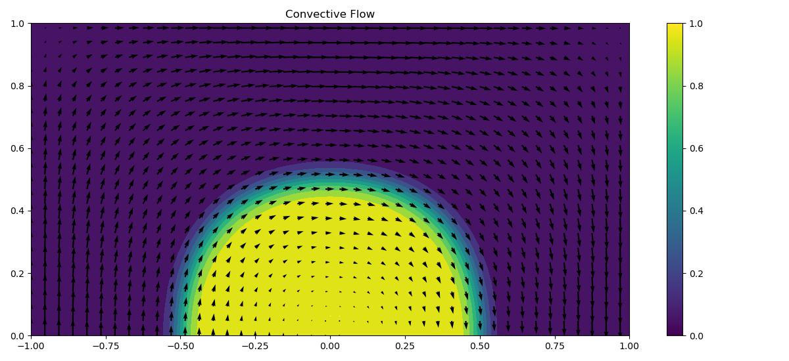

# cool_linear_solver
 
An easy going (contrained) linear solver with sparse methods and minimal effort

## Installation

```bash
pip install cool-linear-solver
```

# Examples 

## 1. Linear Equations

### 1.1 Basic example

usage:

```python
from cool_linear_solver import Variable, quick_solve

a = Variable('a')
b = Variable('b')

eq1 = a+b==2
eq2 = b-a==-1
sol = quick_solve([eq1,eq2])

print('a=', sol[a])
print('b=', sol[b])
print('eq1=', sol[eq1])
print('eq2=', sol[eq2])


T = Variable(name='T')
eq1 = T + T + T + T[1]   + 1*T[3.5]==1
eq2 = T + T     + T[1]   - 4*T[3.5]==4
eq3 = T         + T[1]/10+ 0*T[3.5]==-10.5
sol = quick_solve([eq1,eq2,eq3])
print('T=',sol[T]) #evaluated T on the solution
print('T[1]=',sol[T[1]])
print('T[3.5]=',sol[T[3.5]])
# print('T[2.5]=',sol[T[2.5]]) #this will throw an error for it was not present in the source equations
print('eq1=',sol[eq1]) #you can also evaluate expressions
```

As can be seen you can use non-integer indexes and the notation is quite simple.

### 1.2 Heat Equation Solving example

It uses a sparse solver so you can used it as a PDE solver such as solving the heat equation

```python
from cool_linear_solver import Variable, quick_solve

T = Variable(name='T')

#it uses a space solver so you can used it as a PDE solver such as solving the heat equation
import numpy as np
Ny = 2**6+1
Nx = 2*Ny-1
yar = np.linspace(0,1,num=Ny)
xar = np.linspace(-1,1,num=Nx)
dx, dy = xar[1]-xar[0], yar[1]-yar[0]
dxh, dyh = dx/2, dy/2

eqs = []
T = Variable(name='T') #temperature

#define flow
vx = lambda x, y: 2*y*(1-x**2)
vy = lambda x, y: -2*x*(1-y**2)
lamb = 1e-5 #diffusion

#the convection eqautions
Fx = lambda x, y: vx(x,y)*(T[x-dxh, y]+T[x+dxh, y])/2 - lamb*(T[x+dxh, y]-T[x-dxh, y])/dx
Fy = lambda x, y: vy(x,y)*(T[x, y-dyh]+T[x, y+dyh])/2 - lamb*(T[x, y+dyh]-T[x, y-dyh])/dy

for yi in range(Ny):
    for xi in range(Nx):
        x,y = xar[xi], yar[yi]
        if y==0: #bottom
            if x<=0: #bottom left
                eqs.append(T[x,y]==1+np.tanh(10*(2*x+1)))
            else: #bottom right
                eqs.append(T[x,y]==T[x,y+dy])
        elif y==1 or x==-1 or x==1: #any other edge a constant value
            eqs.append(T[x,y]==1-np.tanh(10))
        else: #domain:
            eqs.append(Fx(x+dxh, y) + Fy(x, y+dyh) - Fx(x-dxh, y) - Fy(x, y-dyh)==0) #inflow = outflow
        
sol = quick_solve(eqs)

Tar = [[T[x,y] for x in xar] for y in yar] #setup array 
Tar = np.array(sol[Tar]) #evaluate 
vx_field = [[vx(x,y) for x in xar[::3]] for y in yar[::3]]
vy_field = [[vy(x,y) for x in xar[::3]] for y in yar[::3]]

from matplotlib import pyplot as plt
plt.figure(figsize=(12,5.5), dpi=100)
plt.contourf(xar,yar,Tar, levels=np.linspace(0-1e-2,2,11))
plt.quiver(xar[::3], yar[::3], vx_field, vy_field)
plt.colorbar(); plt.title('Convective Flow'); plt.tight_layout()
plt.show()
```



It can be quite slow in constructing the equations but that is not the goal of this module. 


## 2. Least squares

## 2.1 basic example

```python
from cool_linear_solver import Least_squares, Variable

sys = Least_squares()

a = Variable(name='a')
b = Variable(name='b')
sys.add_objective(a+b)
sys.add_objective(a-b)
sys.add_objective(a+a+4)
sys.solve()
print('a',sys[a], 'b',sys[b])
#solution https://www.wolframalpha.com/input?i=minimize+%28a%2Bb%29%5E2%2B%28a-b%29%5E2%2B%282*a%2B4%29%5E2
```

## 2. Least squares with linear constraints

```python
from cool_linear_solver import Constrained_least_squares, Variable

sys = Constrained_least_squares()
a = Variable(name='a')
b = Variable(name='b')
sys.add_objective(a+5*b)
sys.add_objective(a-b)
sys.add_objective(a+a+4)

sys.add_inequality(a>=-1.5)
sys.add_inequality(b<=1.5)
sys.add_equality(b+2*a==-1)

sys.solve(verbose=1, toarray=False)
print('a',sys[a], 'b',sys[b])
```